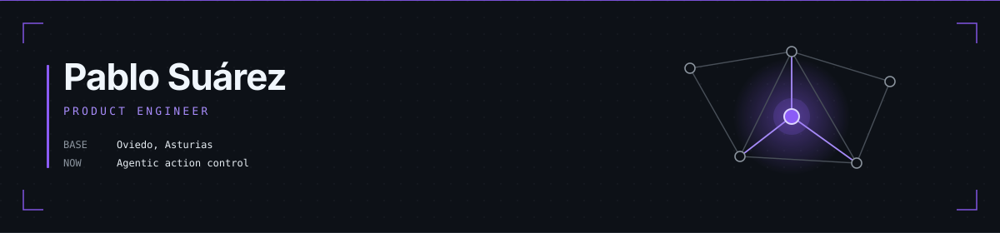
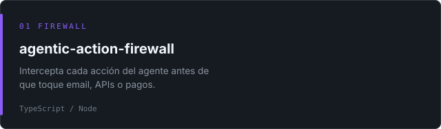
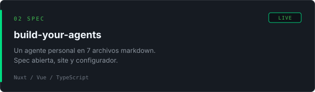
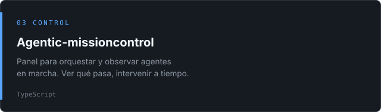
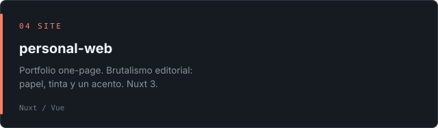

  

  <a href="https://www.linkedin.com/in/pablospena/">LinkedIn</a>
  &nbsp;&nbsp;·&nbsp;&nbsp;
  <a href="https://build-your-agents.vercel.app">build-your-agents</a>

Cojo un problema de usuario, lo convierto en producto o lo agentizo.

 

  
  &nbsp;
  

  
  &nbsp;
  

  
  &nbsp;
  

 

  

  ¿Hablamos de producto, IA o agentes? <a href="https://www.linkedin.com/in/pablospena/">LinkedIn</a>

