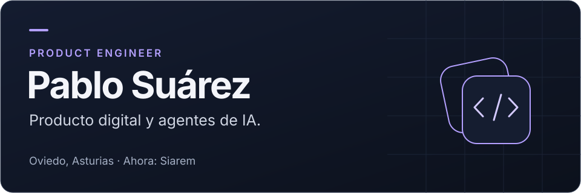
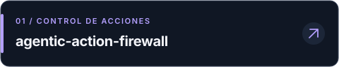
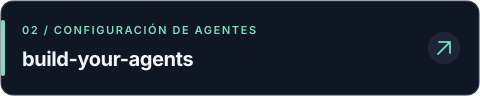
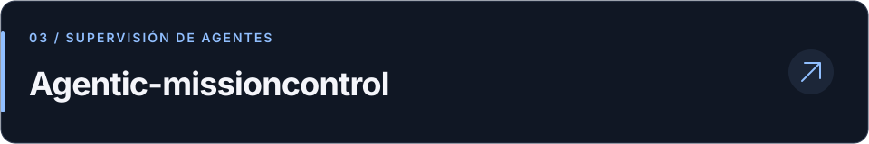
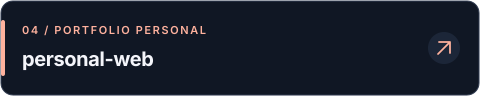
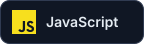
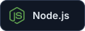
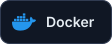

  

  <a href="https://www.linkedin.com/in/pablospena/">LinkedIn</a>
  &nbsp; / &nbsp;
  <a href="https://build-your-agents.vercel.app">Build your agents</a>
  &nbsp; / &nbsp;
  <a href="https://github.com/4pablospena?tab=repositories">Repositorios</a>

## Del problema al producto

Construyo productos digitales a partir de problemas de usuario. Trabajo con TypeScript, React y Vue, y desarrollo herramientas para configurar agentes de IA, supervisar su actividad y controlar sus acciones.

Me interesa cómo encajan los agentes en un producto: qué pueden hacer, qué límites necesitan y cómo interviene la persona que los utiliza.

## Proyecto actual · Siarem

Estoy desarrollando **Siarem**, un CRM en español para gestionar ventas y entrega en equipo. Reúne empresas, leads, oportunidades, pedidos, proyectos y facturas en un mismo espacio.

El flujo conecta la venta con el trabajo: al confirmar un pedido, se crea el proyecto y la oportunidad pasa a ganada. Incluye un pipeline visual, tableros de tareas y seguimiento de facturación.

**React · TypeScript · Tailwind CSS · Cloudflare · Drizzle ORM** &nbsp; · &nbsp; [Explorar Siarem →](https://github.com/4pablospena/siarem)

## Otros proyectos

Control de las acciones de un agente antes de interactuar con servicios externos, como correo, APIs o pagos.

**TypeScript · Node.js** &nbsp; · &nbsp; [Explorar el código →](https://github.com/4pablospena/agentic-action-firewall)

Una especificación abierta y un configurador para definir un agente personal en archivos Markdown.

**Nuxt · Vue · TypeScript** &nbsp; · &nbsp; [Abrir el configurador →](https://build-your-agents.vercel.app)

Un panel para coordinar agentes y observar su actividad, con una visión de lo que está ocurriendo para poder intervenir.

**TypeScript** &nbsp; · &nbsp; [Explorar el código →](https://github.com/4pablospena/Agentic-missioncontrol)

Mi portfolio en una sola página. Una exploración de diseño editorial con tipografía, contraste y una paleta reducida.

**Nuxt · Vue** &nbsp; · &nbsp; [Explorar el código →](https://github.com/4pablospena/personal-web)

## Herramientas

**Producto y frontend**

  
  
  
  
  
  

**Backend y automatización**

  
  
  

**Desarrollo con IA**

  
  
  

**Infraestructura y observabilidad**

  
  
  
  

---

¿Trabajas en un producto con IA o herramientas para agentes? [Hablemos en LinkedIn →](https://www.linkedin.com/in/pablospena/)
